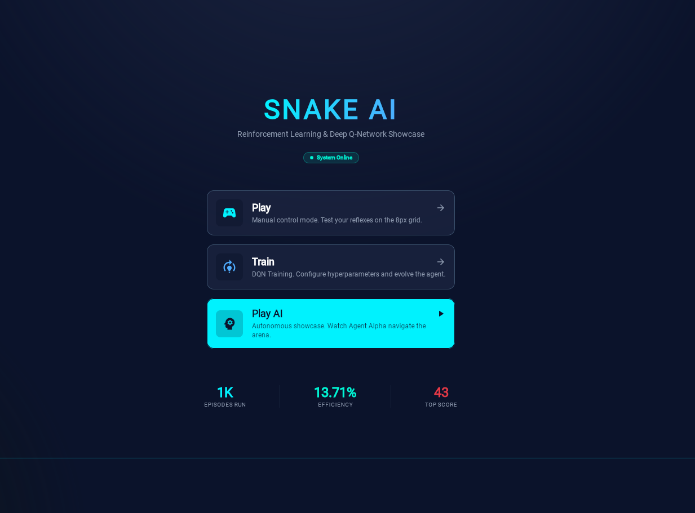
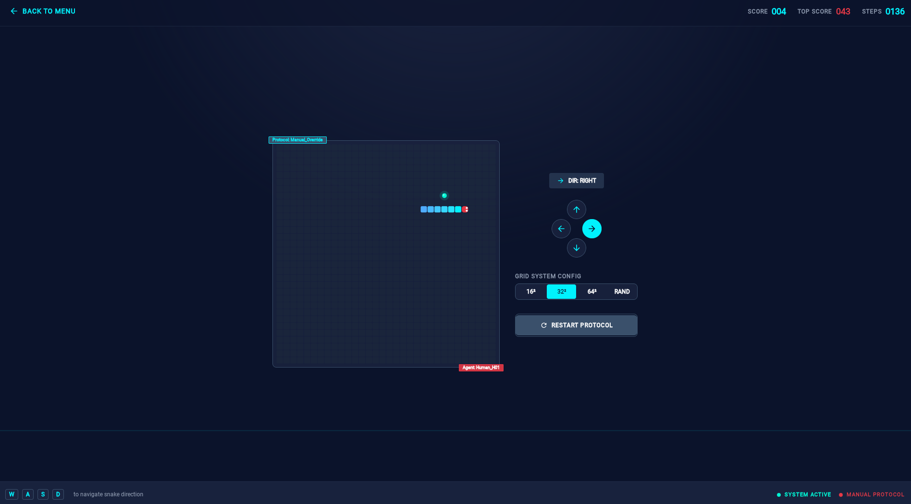
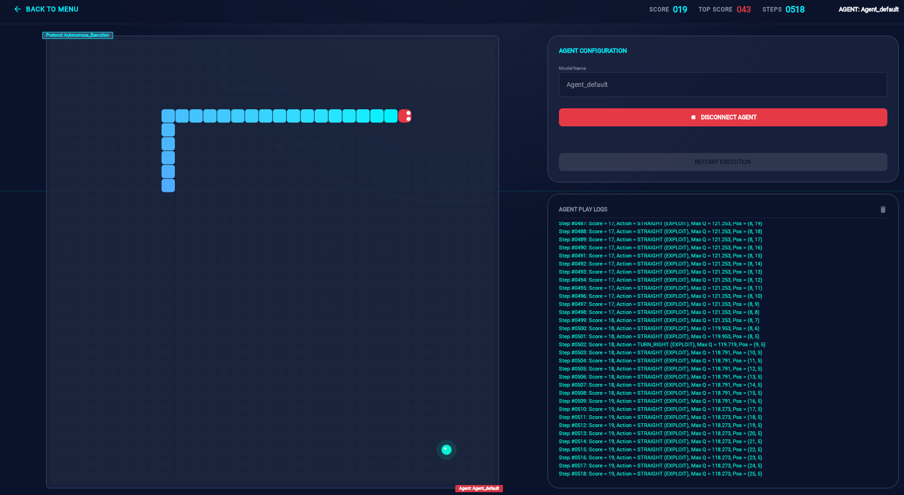
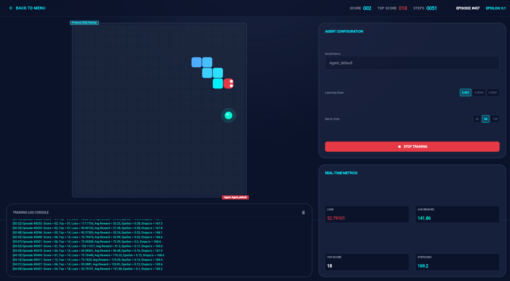

# SnakeAI — Hybrid Multiplatform Reinforcement Learning System

**SnakeAI** is a full-stack, real-time reinforcement learning system that pairs a classic Snake game with an autonomous Deep Q-Network (DQN) agent. The application features a stunning retro-cyberpunk user interface built using **Compose Multiplatform** (targeting both Desktop JVM and Web Wasm-JS), powered by a reactive **Spring Boot** backend using **Deeplearning4j (DL4J)** for the neural network training loop.

---

## 📸 Visual Showcase

### Application Screens
| Main Menu | Manual Play Mode |
|:---:|:---:|
|  |  |

| AI Play (Showcase) | DQN Training Dashboard |
|:---:|:---:|
|  |  |

---

## 🚀 Key Features

*   **Cyberpunk HUD UI:** Immersive dark-mode visual interface with glow effects, CRT-style scanlines, custom typography, and fluid state changes.
*   **Compose Multiplatform Client:** A single Kotlin codebase running seamlessly on the JVM (desktop app) and Web (compiled to Wasm-JS).
*   **Reactive WebSockets:** Bi-directional real-time telemetry streaming of state, steps, rewards, and training logs from backend to frontend.
*   **Virtual Steering Gamepad:** Live UI representation of the agent's steering decisions (Straight, Left, Right) highlighting current action choices.
*   **Production Deployment:** Containerized with Docker and deployed to AWS ECS Fargate via GitHub Actions with S3 model serialization and cloud telemetry.

---

## 🛠️ System Tech Stack

| Component | Technology | Purpose |
| :--- | :--- | :--- |
| **Frontend** | Kotlin Multiplatform | Shared presentation logic and cross-platform UI compilation |
| | Compose Multiplatform | Retro-cyberpunk user interfaces (Desktop & Web/Wasm-JS) |
| | Koin | Dependency injection (DI) container |
| | Ktor Client | REST and WebSocket client networking |
| **Backend** | Spring Boot | Core server application framework |
| | Spring WebFlux | Reactive WebSockets & non-blocking APIs |
| | Spring Data JPA | Relational database access & model metadata tracking |
| | Deeplearning4j (DL4J) | DQN agent training, policy optimization, and serialization |
| | ND4J (`nd4j-native`) | High-performance CPU linear algebra engine |
| **Storage** | H2 Database | Embedded file storage for local development session logs |
| | PostgreSQL | Production database for model configurations |
| | Amazon S3 | Cloud storage for trained agent model `.zip` weights |
| **CI/CD & DevOps** | GitHub Actions | CI/CD pipeline (OIDC Role Assumption, Gradle build) |
| | Docker & Docker Compose | Multi-container local orchestration (Backend, Frontend, LocalStack) |
| | AWS ECS Fargate | Serverless container hosting |

---

## 🧠 Machine Learning Architecture

The Snake game is modeled as a discrete Markov Decision Process (MDP) utilizing reinforcement learning principles:

### 1. State Space (11-Dimensional Observation Vector)
Instead of processing full image matrices or coordinate lists, the agent perceives its environment through an efficient 11-dimensional feature vector:
*   **Danger Sensors (3D):** Immediate risk of collision in the relative front, left, and right directions (`1.0` if obstacle/wall/tail, `0.0` if safe).
*   **Heading Direction (4D):** One-hot representation of the current movement direction (Up, Down, Left, Right).
*   **Relative Food Coordinates (4D):** One-hot direction indicators showing if food is North, East, South, or West of the snake's head.

### 2. Action Space (3 Discrete Relative Actions)
To make model learning translation-invariant, actions are represented relative to the head's current orientation:
*   `0` — **STRAIGHT** (Keep current direction)
*   `1` — **LEFT** (Turn 90 degrees counter-clockwise)
*   `2` — **RIGHT** (Turn 90 degrees clockwise)

### 3. Neural Network Design (Double DQN)
Built with Deeplearning4j, the network consists of feedforward dense layers structured as:
*   **Input Layer:** 11 nodes (observation vector)
*   **Hidden Layer 1:** 256 units with ReLU activation
*   **Hidden Layer 2:** 128 units with ReLU activation
*   **Output Layer:** 3 units with Identity activation (outputting estimated Q-values for relative actions)
*   **Optimization:** Mean Squared Error (MSE) loss, trained via the Adam optimizer (default learning rate `0.001`).

### 4. Reward Shaping
*   **`+10.0`** — Eating food (score increment)
*   **`+10.0`** — Reaching victory state
*   **`-10.0`** — Colliding with walls or tail (game over)
*   **`+1.0`** — Moving closer to the food (decrease in Manhattan distance)
*   **`-1.5`** — Moving away from the food (increase in Manhattan distance)

---

## 💻 Local Setup & Running Guide

### Running Dev Mode Locally

Ensure you have **JDK 21+** configured.

1. **Start the Backend server:**
   ```bash
   ./gradlew :backend:bootRun
   ```
   The backend starts on port `8080` (H2 database console at `http://localhost:8082`).

2. **Start the Frontend client:**
   *   **Desktop app:**
       ```bash
       ./gradlew :frontend:composeApp:jvmRun
       ```
   *   **Web client (Wasm-JS):**
       ```bash
       ./gradlew :frontend:composeApp:wasmJsBrowserRun
       ```
       Open the browser at `http://localhost:8080` (or target dev server port).

### Running with Docker Compose
To launch the full dockerized system (including local S3 model storage mock via LocalStack):
```bash
docker-compose up --build
```
*   **Frontend Client:** Accessible at `http://localhost` (port `80`).
*   **Backend Server:** Accessible at `http://localhost:8080`.
*   **LocalStack S3 Admin Console:** Running on port `4566`.

---

## ☁️ AWS Cloud Production Deployment

Our production setup utilizes a serverless architecture designed for scalability, zero downtime, and container isolation:

1. **Continuous Deployment:** On commits to `main`, GitHub Actions authenticates with AWS via secure OpenID Connect (OIDC) roles (no static credentials).
2. **Container Registry:** Builds and tags docker images, pushing them to Amazon ECR.
3. **Container Service:** Deploys new task definitions to **Amazon ECS Fargate** cluster, utilizing blue/green deployment strategy for:
   *   `snakeai-backend-service` (Spring Boot environment communicating with RDS PostgreSQL)
   *   `snakeai-frontend-service` (Web Nginx static bundle router)
4. **Data Assets Persistence:** Model binary file checkpointing `.zip` weights are persisted directly to **Amazon S3** cloud buckets, while training history logs are recorded in a PostgreSQL DB on **Amazon RDS**.
